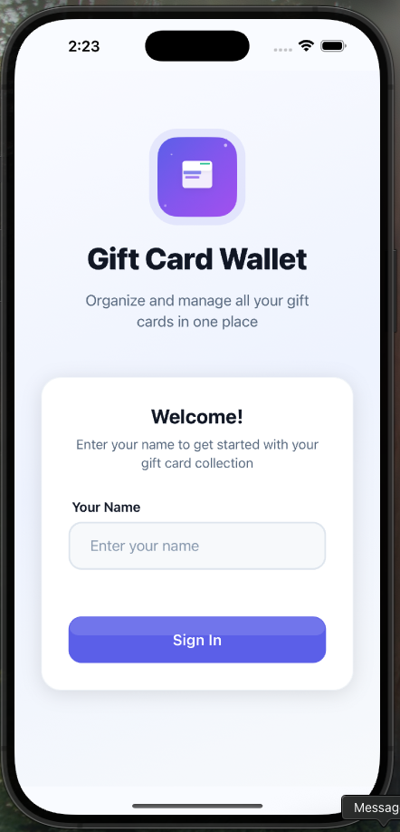
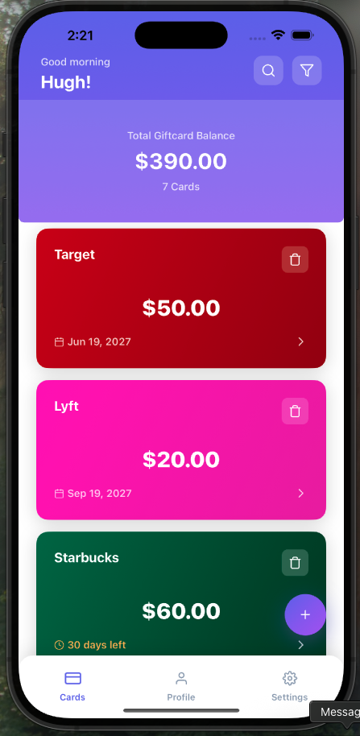
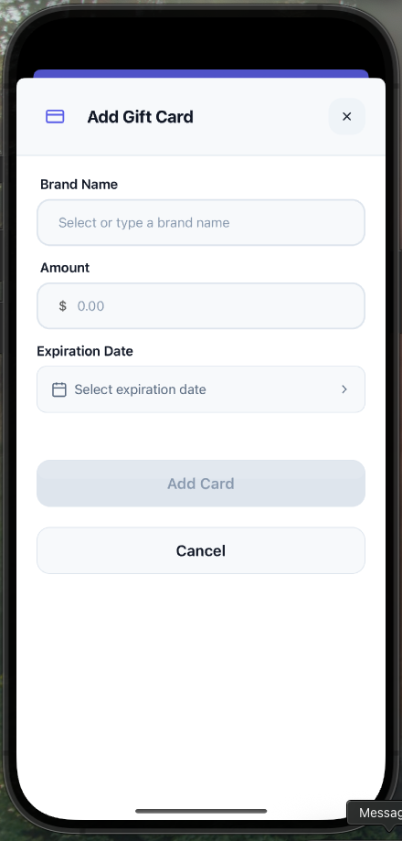
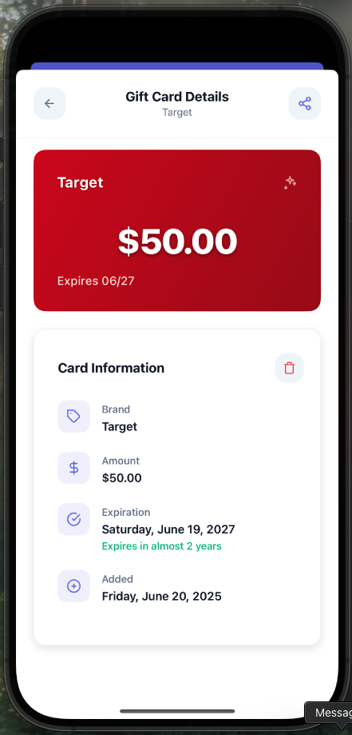

# MyRewardVault

A React Native mobile application that allows users to store, view, and manage their gift cards. Built with TypeScript, Redux, and modern React Native best practices.

## 🎯 Features

- **Gift Card Management**: Add, view, and remove gift cards
- **Offline Storage**: All data persisted locally using AsyncStorage
- **User Authentication**: Simple name-based sign-in system
- **Card Details**: View detailed information including brand, amount, and expiration date
- **Responsive Design**: Clean, modern UI with smooth animations
- **Performance Optimized**: Uses FlatList for efficient rendering

## 📱 Screenshots

<table>
  <tr>
    <td align="center">
      
      <br />
      <b>Sign-In Screen</b>
      <br />
      <sub>Welcome screen where users enter their name to get started</sub>
    </td>
    <td align="center">
      
      <br />
      <b>Home Screen</b>
      <br />
      <sub>Main dashboard showing all gift cards with total balance</sub>
    </td>
  </tr>
  <tr>
    <td align="center">
      
      <br />
      <b>Add Card Modal</b>
      <br />
      <sub>Form to add new gift cards with brand, amount, and expiration date</sub>
    </td>
    <td align="center">
      
      <br />
      <b>Card Detail Modal</b>
      <br />
      <sub>Detailed view of individual gift cards with all information</sub>
    </td>
  </tr>
</table>

### 📹 Demo Video

**App Walkthrough** _(51MB)_

<div align="center">
  <video width="350" controls>
    <source src="./assets/app-demo.mov" type="video/quicktime">
    Your browser does not support the video tag.
  </video>
</div>

### Project Structure

```
src/
├── components/
│   ├── common/                 # Reusable UI components
│   │   ├── Button.tsx
│   │   ├── CustomIcons.tsx
│   │   ├── DatePickerInput.tsx
│   │   ├── EmptyState.tsx
│   │   ├── FloatingActionButton.tsx
│   │   └── Input.tsx
│   ├── giftcard/              # Gift card specific components
│   │   ├── GiftCardDetails.tsx
│   │   ├── GiftCardForm.tsx
│   │   └── GiftCardItem.tsx
│   ├── modals/                # Modal components
│   │   ├── AddGiftCardModal.tsx
│   │   └── GiftCardDetailModal.tsx
│   └── signin/                # Sign-in related components
│       ├── SignInForm.tsx
│       └── WelcomeHeader.tsx
├── constants/
│   ├── brands.ts              # Supported gift card brands
│   └── theme.ts               # App theme and styling constants
├── hooks/
│   └── useGiftCards.ts        # Custom hook for gift card operations
├── navigation/
│   └── StackNavigator.tsx     # App navigation configuration
├── screens/
│   ├── Home.tsx               # Main dashboard screen
│   └── SignIn.tsx             # User authentication screen
├── services/
│   └── storageService.ts      # AsyncStorage wrapper service
├── store/
│   ├── giftCardSlice.ts       # Redux slice for gift card state
│   └── index.ts               # Redux store configuration
├── types/
│   └── index.ts               # TypeScript type definitions
└── utils/
    └── validation.ts          # Form validation utilities
```

## 🛠️ Tech Stack

- **React Native** (0.80.0) - Mobile framework
- **TypeScript** - Type safety and better development experience
- **Redux Toolkit** - State management
- **React Navigation** - Navigation between screens
- **AsyncStorage** - Offline data persistence
- **React Hook Form** - Form handling and validation
- **React Native Paper** - UI components
- **React Native Reanimated** - Smooth animations
- **Date-fns** - Date manipulation utilities
- **Lottie React Native** - Advanced animations
- **React Native Vector Icons** - Icon library (Also used custom svg icons, because this does not work)

## 🚀 Getting Started

### Prerequisites

- Node.js >= 18
- React Native development environment setup
- Android Studio (for Android development)
- Xcode (for iOS development)

### Installation

1. **Clone the repository**

   ```bash
   git clone https://github.com/Endenxu/myrewardvault.git
   cd myrewardvault
   ```

2. **Install dependencies**

   ```bash
   npm install
   # or
   yarn install
   ```

3. **iOS Setup** (iOS only)

   ```bash
   # Install Ruby bundler (first time only)
   bundle install

   # Install CocoaPods dependencies
   cd ios && bundle exec pod install && cd ..
   ```

### Running the App

1. **Start Metro bundler**

   ```bash
   npx react-native start
   # or
   npx react-native start
   ```

2. **Run on Android**

   ```bash
   npx react-native run-android
   # or
   npx react-native run-android
   ```

3. **Run on iOS**
   ```bash
   npx react-native run-ios
   # or
   npx react-native run-ios
   ```

## 📋 User Stories Implementation

### ✅ View Gift Cards List

- Users can see all stored gift cards with brand, amount, and expiration date
- Total balance displayed at the top
- Cards organized in an easy-to-scan list format

### ✅ Add New Gift Card

- Modal form for adding new cards
- Brand selection with popular options
- Amount input with currency formatting
- Expiration date picker
- Form validation for all fields

### ✅ View Gift Card Details

- Detailed modal showing full card information
- Brand-specific styling and colors
- Expiration status indicators
- Date added tracking

### ✅ Remove Gift Cards

- Delete functionality from detail view
- Confirmation before removal
- State management updates

## 🏛️ Development Guidelines Compliance

### ✅ TypeScript

- Full TypeScript implementation
- Strict type checking enabled
- Custom type definitions for all data structures

### ✅ Reusable Components

- Modular component architecture
- Common UI components for consistency
- Props-based customization

### ✅ React Navigation

- Stack navigation for screen management
- Modal presentation for forms
- Type-safe navigation params

### ✅ Redux State Management

- Redux Toolkit for modern Redux patterns
- Normalized state structure
- Actions and reducers for all operations

### ✅ Offline Storage

- AsyncStorage for data persistence
- Service layer abstraction
- Error handling for storage operations

### ✅ Performance Optimization

- FlatList for efficient list rendering
- Memoized components where appropriate
- Optimized re-renders

### ✅ Error Handling

- Try-catch blocks for async operations
- User-friendly error messages

### ✅ Bare React Native

- No Expo dependencies
- Native module integration where needed
- Full control over native code

## 📦 Key Dependencies

### Core

- `react-native`: 0.80.0
- `react`: 19.1.0
- `typescript`: 5.0.4

### State Management

- `@reduxjs/toolkit`: State management
- `react-redux`: React bindings for Redux

### Navigation

- `@react-navigation/native`: Navigation framework
- `@react-navigation/native-stack`: Stack navigator
- `@react-navigation/bottom-tabs`: Tab navigator

### Storage & Data

- `@react-native-async-storage/async-storage`: Local storage
- `date-fns`: Date utilities
- `react-hook-form`: Form management

### UI & Animations

- `react-native-paper`: Material Design components
- `react-native-reanimated`: Advanced animations
- `lottie-react-native`: Lottie animations
- `react-native-vector-icons`: Icon library

---

**Built using React Native and TypeScript**
